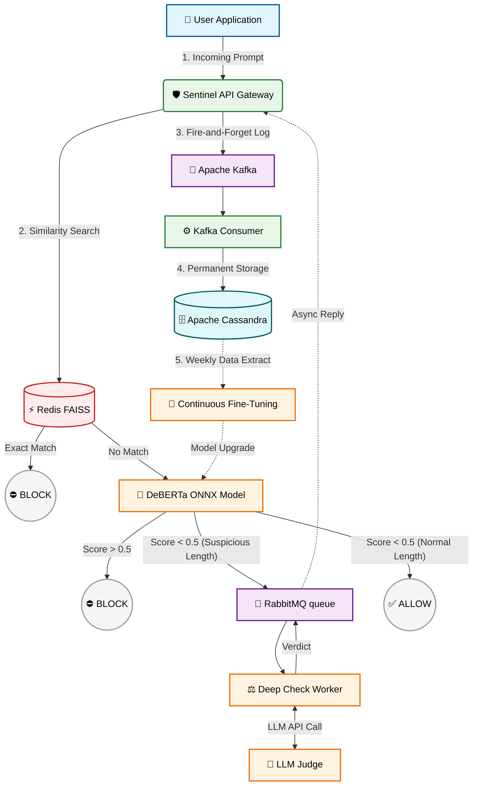

# Sentinel Architecture

```mermaid
flowchart TD
    %% Styling
    classDef userApp fill:#e1f5fe,stroke:#01579b,stroke-width:2px,color:#000000
    classDef gateway fill:#e8f5e9,stroke:#2e7d32,stroke-width:2px,color:#000000
    classDef redis fill:#ffebee,stroke:#c62828,stroke-width:2px,color:#000000
    classDef ml fill:#fff3e0,stroke:#ef6c00,stroke-width:2px,color:#000000
    classDef queue fill:#f3e5f5,stroke:#6a1b9a,stroke-width:2px,color:#000000
    classDef data fill:#e0f7fa,stroke:#006064,stroke-width:2px,color:#000000
    classDef endpoint fill:#f5f5f5,stroke:#9e9e9e,stroke-width:2px,color:#000000

    User["📱 User Application"]:::userApp -->|1. Incoming Prompt| API("🛡️ Sentinel API Gateway"):::gateway
    API -->|2. Similarity Search| Redis[("⚡ Redis FAISS")]:::redis
    Redis -- "Exact Match" --> Block1(("⛔ BLOCK")):::endpoint
    Redis -- "No Match" --> DeBERTa["🧠 DeBERTa ONNX Model"]:::ml
    DeBERTa -- "Score > 0.5" --> Block2(("⛔ BLOCK")):::endpoint
    DeBERTa -- "Score < 0.5 (Suspicious Length)" --> RabbitMQ["🐇 RabbitMQ queue"]:::queue
    DeBERTa -- "Score < 0.5 (Normal Length)" --> Allow(("✅ ALLOW")):::endpoint
    RabbitMQ --> DeepCheck["⚖️ Deep Check Worker"]:::ml
    DeepCheck <-->|LLM API Call| Groq["🤖 LLM Judge"]:::ml
    DeepCheck -- "Verdict" --> RabbitMQ
    RabbitMQ -. "Async Reply" .-> API
    API -->|3. Fire-and-Forget Log| Kafka["🚀 Apache Kafka"]:::queue
    Kafka --> Consumer["⚙️ Kafka Consumer"]:::gateway
    Consumer -->|4. Permanent Storage| Cassandra[("🗄️ Apache Cassandra")]:::data
    Cassandra -. "5. Weekly Data Extract" .-> FineTune["🔄 Continuous Fine-Tuning"]:::ml
    FineTune -. "Model Upgrade" .-> DeBERTa
```
